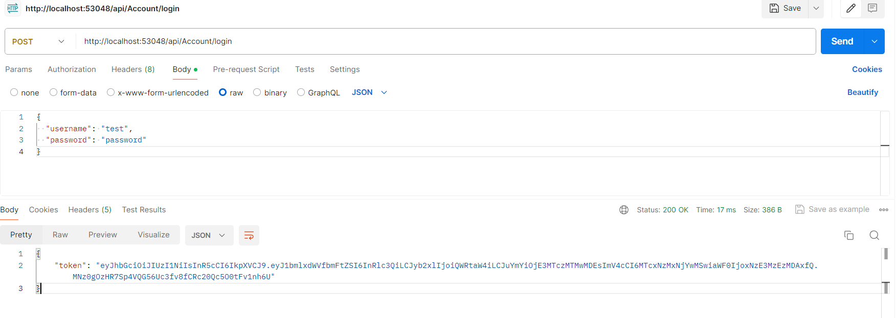
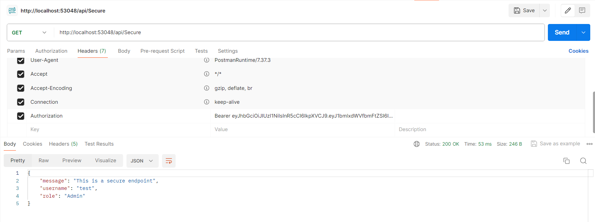
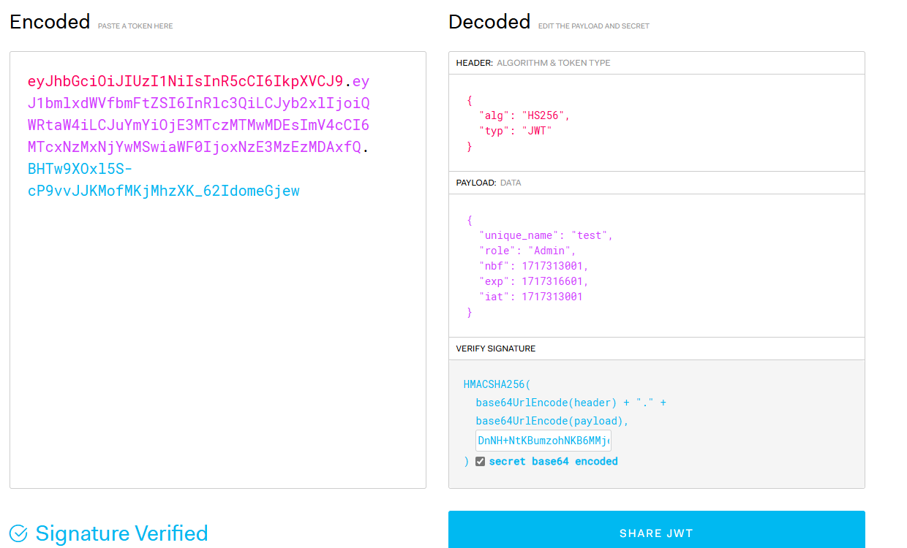

JSON Web Tokens (JWT) are a popular method for securely transmitting information between parties as a JSON object. JWTs are compact, URL-safe tokens that can be used for authentication and information exchange. 

### Workflow:
1. User Authentication:
    - user authenticates with the application server using their credentials (e.g., username and password).

2. Token Generation
    - Upon successful authentication, the server generates a JWT containing claims (e.g., user ID, username, roles) and signs it using a secret key.
    - Claims can be any information that needs to be transmitted, such as user roles, permissions, or other data.

3. Token Issuance
    - Server sends the JWT back to the client as part of the authentication response (e.g., in the response body or HTTP headers).

4. Token Storage
    - The client typically stores the JWT securely, commonly in browser local storage, session storage, or cookies, depending on the application's requirements and security considerations.

5. Token Usage
    - Subsequent requests from the client to the server include the JWT in the Authorization header using the Bearer schema:
        - Authorization: Bearer your_jwt_token_here
    - The server verifies the JWT's signature using the secret key it used to sign the token. If the signature is valid, it extracts the claims from the JWT.

6. Claims Verification
    - The server verifies the claims contained within the JWT to ensure they meet the access requirements for the requested resource.
    - This may involve checking the user's role, permissions, or any other relevant information included in the JWT claims.

7. Access Granted
    - If the JWT is valid and the claims are satisfactory, the server grants access to the requested resource or performs the requested action on behalf of the authenticated user.

8. Token Expiration and Refresh
    - JWTs often have an expiration time (defined in the exp claim), after which they are considered invalid.
    - If the token expires, the client may need to refresh it by requesting a new JWT from the server using a refresh token or by re-authenticating.
    - Refresh tokens are usually long-lived tokens used to obtain new JWTs without requiring the user to re-enter their credentials.

9. Logging Out
    - Client typically discards the JWT or marks it as invalidated on the server side.
    - This prevents further use of the JWT for accessing protected resources.

**Benefits of JWT**:
- Stateless: JWTs are self-contained, so no need to store session state on the server.
- Compact: JWTs are small and can be transmitted easily.
- Decentralized: JWTs can be verified without needing to communicate with a central server.
- Extensible: JWTs support custom claims to include additional information as needed.

1. Login

    

2. Accessing secure API

    

3. Signature With out Secret Key

    

4. Signature With Secret Key

    
