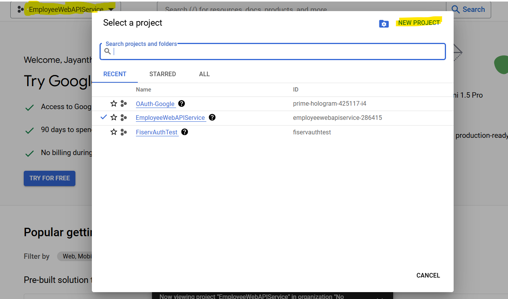
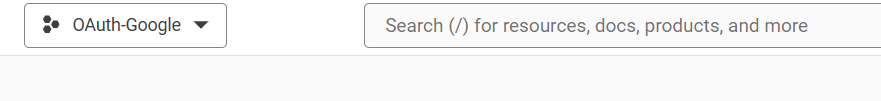
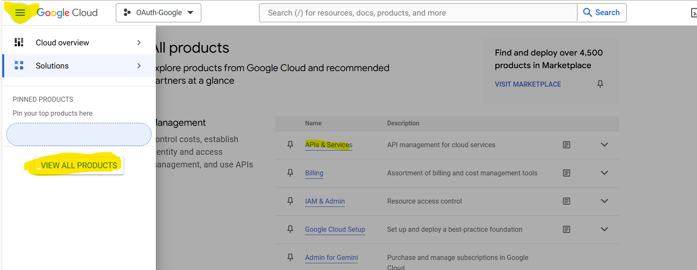
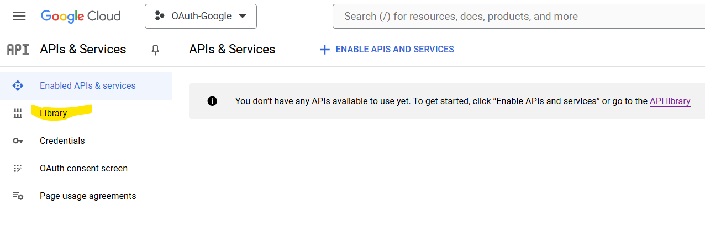
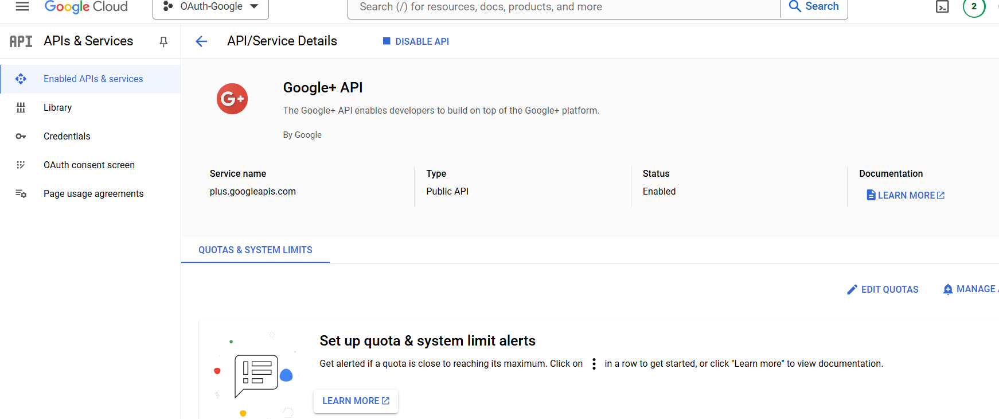
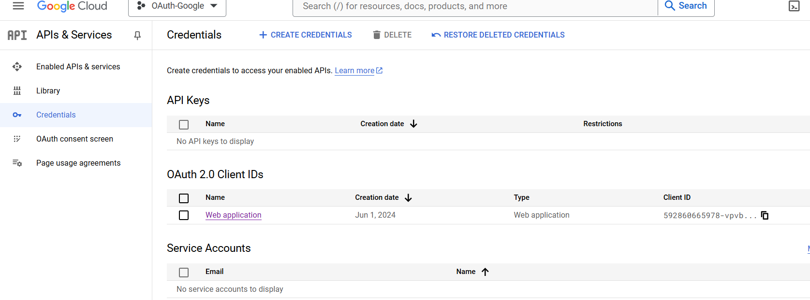
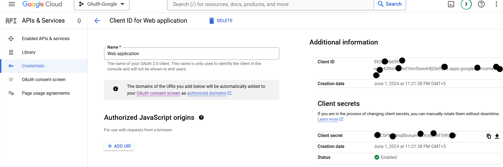

OAuth is an open standard for access delegation commonly used as a way to grant websites or applications limited access to a user's information without exposing passwords. 

[Sample Project](Oauth-Google/)

1. Create a new ASP.NET Core Web Application and Choose "Web Application (Model-View-Controller)" and click "Create."
2. Install the nuget package " Microsoft.AspNetCore.Authentication.Google"
3. In appSettings.json add
    ```markdown
    "Authentication": {
    "Google": {
      "ClientId": "your-google-client-id",
      "ClientSecret": "your-google-client-secret"
    }
  }
    ```
4. Navigate to the Google Cloud Console and create a project
    
    

5. In the left-hand navigation menu, go to "APIs & Services" > "Library" and Search for "Google+ API" and click on it.
    
    
6. Enable it by clicking the "Enable" button.
    
7. Configure the OAuth-google
8. In the left-hand navigation menu, go to "APIs & Services" > "OAuth consent screen." and Select "External" and click "Create."
9. Enter the required details such as App name, User support email and Click "Save and Continue."
10. Create OAuth 2.0 Credentials, go to "APIs & Services" > "Credentials." and click "Create Credentials" and select "OAuth 2.0 Client IDs."
    
11. Configure the application type as "Web application." and enter the Authorized redirect URIs (e.g., https://localhost:5001/signin-google).
    
12. Click "Create." and copy the Client ID and Client Secret to configure in the project
