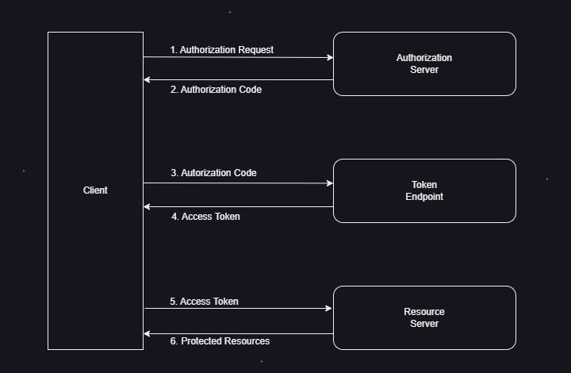

OAuth is an open standard for access delegation commonly used as a way to grant websites or applications limited access to a user's information without exposing passwords. 

1. User Login
    - User tries to access a resource that requires authentication.
2. Redirect to provider(Google, Azure,Okta) OAuth 2.0 Server
    - Application redirects the user to provider's OAuth 2.0 authorization endpoint
        - https://<provider domain(google or azure)>/o/oauth2/v2/auth?
            client_id=your_client_id&
            response_type=code&
            redirect_uri=your_redirect_uri&
            scope=openid email profile
3. User Authenticates with their account (google or Azure)
4. Authorization Code Issued
    - If authentication is successful, provider redirects the user back to the application's redirect URI with an authorization code.
    - Example redirect URI with authorization code
        - https://yourapp.com/redirect_uri?code=authorization_code
5. Exchange Code for Token
    - Application server sends a POST request to provider's token endpoint to exchange the authorization code for an access token
        - POST https://oauth2.googleapis.com/token
            Content-Type: application/x-www-form-urlencoded
            code=authorization_code&
            client_id=your_client_id&
            client_secret=your_client_secret&
            redirect_uri=your_redirect_uri&
            grant_type=authorization_code
6. Access Token is Received
7. Access Resource
    - The application uses the access token to access the protected resource on behalf of the user.

**Workflow**

1. The client requests authorization from the authorization server.
2. The authorization server returns an authorization code.
3. The client exchanges the authorization code for an access token.
4. The authorization server returns the access token.
5. The client uses the access token to request the protected resource from the resource server.
6. The resource server returns the protected resource.

- **Protected Resource Server**:
    - When the protected resource server receives a request with an access token, it needs to validate the token before granting access.
    - The server verifies the access token's authenticity and integrity. This often involves checking the token's signature against the issuer's public keys or using other token validation mechanisms provided by the authorization server.

- **Token Verification**:
    - The protected resource server sends a request to the authorization server's token introspection or validation endpoint, providing the access token.
    - The authorization server validates the access token and responds with information about the token, such as its validity, scope, and expiration.
    - If the token is valid and authorized to access the requested resource, the protected resource server serves the requested resource.

- **Caching**:
    - To avoid unnecessary token validation requests, the protected resource server may cache the validation results, including the token's validity and associated information.
    - This caching mechanism helps improve performance and reduce the load on the authorization server.

- **Token Expiration**:
    - Access tokens have a limited lifespan, after which they expire.
    - If the access token has expired, the protected resource server may return an error response (e.g., HTTP 401 Unauthorized) and prompt the client to obtain a new access token by repeating the OAuth authentication flow.